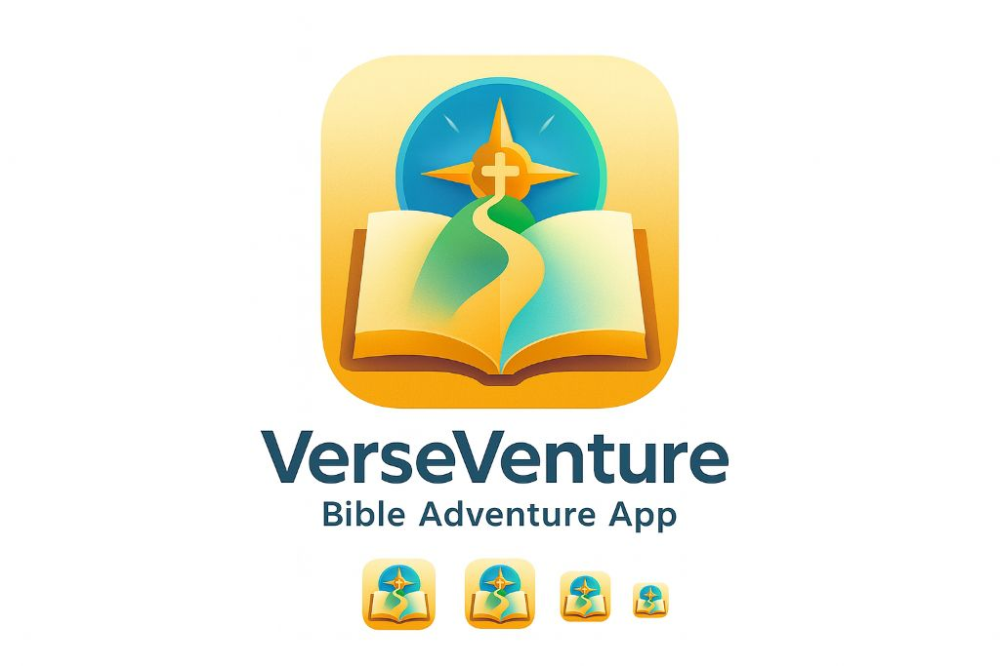

# VerseVenture - Bible Adventure App



## Project Overview
- **Name**: VerseVenture
- **Goal**: Create an interactive, gamified Bible learning platform that makes scripture study engaging and fun
- **Features**: Adventure-based Bible lessons, progress tracking, achievements, daily verses, and leaderboards

## 🌐 URLs
- **Development**: https://3000-i98qofry0ijme77wucd0q-6532622b.e2b.dev
- **Production**: https://verseventure.pages.dev (when deployed)
- **GitHub**: Not yet deployed

## ✨ Currently Completed Features

### 🎮 Interactive Adventures
- **Quest-based Learning**: Complete Bible-themed adventures with questions and challenges
- **Difficulty Levels**: Easy, Medium, and Hard adventures for all skill levels
- **Progressive Learning**: Adventures build upon each other with increasing complexity
- **Real-time Scoring**: Track points and progress as you complete adventures

### 📖 Scripture Library
- **Verse Collection**: Browse and study verses from both Old and New Testaments
- **Random Verse Generator**: Get inspired with random scripture selections
- **Daily Verse Feature**: New inspirational verse every day with reflections
- **Category Filtering**: Find verses by book, testament, or theme

### 👤 User Progress System
- **Points & Rewards**: Earn points for completing adventures and studying verses
- **Streak Tracking**: Build daily study habits with streak counters
- **Achievement Badges**: Unlock special badges for milestones
- **Personal Stats**: View your learning journey and accomplishments

### 🏆 Social Features
- **Leaderboard**: Compete with other users for top rankings
- **User Profiles**: Customizable avatars and display names
- **Progress Sharing**: See how you rank among other Bible learners

### 🛠️ Technical Features
- **Responsive Design**: Works perfectly on desktop, tablet, and mobile
- **Beautiful UI**: Modern, colorful interface with smooth animations
- **Fast Performance**: Edge-deployed for lightning-fast response times
- **Offline Support**: Local storage for user progress and preferences

## 📡 API Endpoints

### Verses API
- `GET /api/verses` - Get all verses (supports filters: testament, book, category)
- `GET /api/verses/random` - Get a random verse
- `GET /api/verses/daily` - Get today's daily verse with reflection

### Adventures API
- `GET /api/adventures` - List all adventures (supports difficulty filter)
- `GET /api/adventures/:id` - Get specific adventure with questions and verses

### Progress API
- `POST /api/progress` - Save user progress for an adventure
- `GET /api/users/:id/stats` - Get user statistics and achievements

### Social API
- `GET /api/leaderboard` - Get top users by points (supports limit parameter)

## 💾 Data Architecture

### Data Models
- **Verses**: Bible verses with book, chapter, verse number, text, and categories
- **Adventures**: Interactive lessons with questions, difficulty levels, and rewards
- **Users**: User profiles with points, streaks, and preferences
- **Progress**: Tracks user completion of adventures with scores and time spent
- **Badges**: Achievement system with various requirement types
- **Daily Verses**: Curated daily scripture with reflections

### Storage Services
- **Database**: Cloudflare D1 (SQLite) for relational data
- **KV Storage**: Cloudflare KV for session data
- **Local Storage**: Browser storage for user preferences

### Data Flow
1. Users browse adventures and verses through the frontend
2. API calls fetch data from D1 database
3. Progress is tracked and stored in real-time
4. Achievements are calculated and awarded automatically
5. Leaderboard updates reflect current rankings

## 📚 User Guide

### Getting Started
1. **Visit the App**: Open the app in your browser
2. **Explore Home**: View your daily verse and quick actions
3. **Start an Adventure**: Click on "Adventures" tab and choose your difficulty
4. **Study Verses**: Read the scripture before answering questions
5. **Answer Questions**: Select the correct answer to earn points
6. **Track Progress**: View your stats and achievements in the Progress tab
7. **Compete**: Check the leaderboard to see how you rank

### Tips for Success
- **Daily Visits**: Build your streak by studying every day
- **Complete Adventures**: Finish all adventures to unlock achievements
- **Study First**: Read verses carefully before attempting questions
- **Try All Difficulties**: Challenge yourself with harder adventures for more points

## 🚀 Deployment

### Platform
- **Cloudflare Pages**: Edge-deployed for global performance
- **Status**: ✅ Ready for production deployment
- **Tech Stack**: Hono + TypeScript + TailwindCSS + Cloudflare D1

### Local Development
```bash
# Install dependencies
npm install

# Apply database migrations
npm run db:migrate:local

# Seed database with sample data
npm run db:seed

# Start development server
npm run dev:sandbox

# Or use PM2
pm2 start ecosystem.config.cjs
```

### Production Deployment
```bash
# Build the project
npm run build

# Deploy to Cloudflare Pages
npm run deploy:prod
```

## 🔮 Features Not Yet Implemented

### Planned Enhancements
1. **User Authentication**: Sign up/login with email or social accounts
2. **Bible Reading Plans**: Structured reading schedules
3. **Verse Memorization**: Interactive memorization games
4. **Community Features**: Share verses and compete with friends
5. **Audio Verses**: Listen to scripture readings
6. **Study Notes**: Personal annotations on verses
7. **Prayer Journal**: Track prayer requests and answers
8. **Multi-language Support**: Translations in multiple languages

## 🎯 Recommended Next Steps

### Immediate Priorities
1. **Deploy to Production**: Set up Cloudflare Pages deployment
2. **Add Authentication**: Implement user login system
3. **Expand Content**: Add more verses and adventures
4. **Mobile App**: Consider React Native or PWA conversion

### Long-term Goals
1. **Community Building**: Add social features and sharing
2. **Content Management**: Admin panel for adding new content
3. **Analytics**: Track user engagement and learning patterns
4. **Partnerships**: Collaborate with churches and Bible study groups

## 🛠️ Technical Details

### Dependencies
- **Frontend**: TailwindCSS, Font Awesome, Chart.js, Axios
- **Backend**: Hono framework for Cloudflare Workers
- **Database**: Cloudflare D1 (SQLite-based)
- **Deployment**: Cloudflare Pages with Wrangler CLI

### Project Structure
```
webapp/
├── src/              # Backend source code
├── public/           # Static assets
├── migrations/       # Database migrations
├── dist/            # Build output
└── ecosystem.config.cjs # PM2 configuration
```

### Environment
- **Node.js**: v20+
- **Wrangler**: v3.114+
- **TypeScript**: v5.0+

## 📞 Contact & Support

For questions, suggestions, or contributions, please open an issue in the GitHub repository.

---

**Last Updated**: September 17, 2025
**Version**: 1.0.0
**Status**: 🟢 Active Development